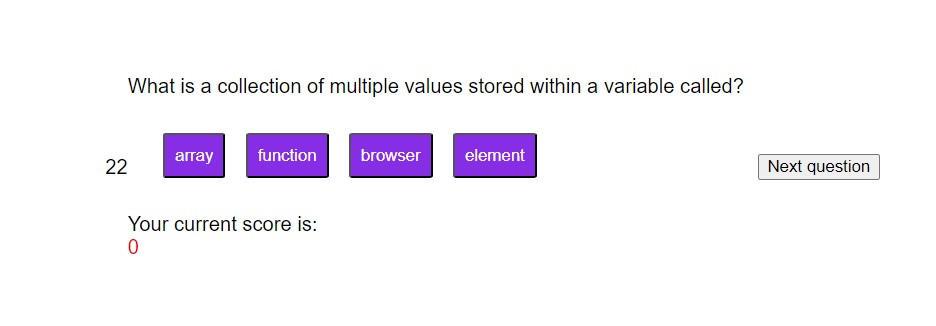
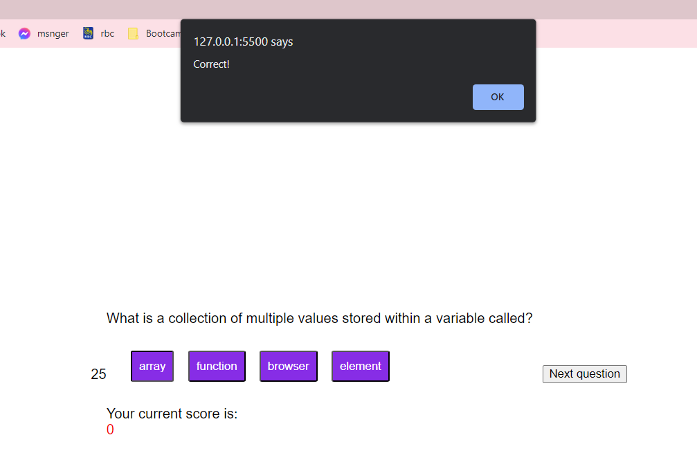
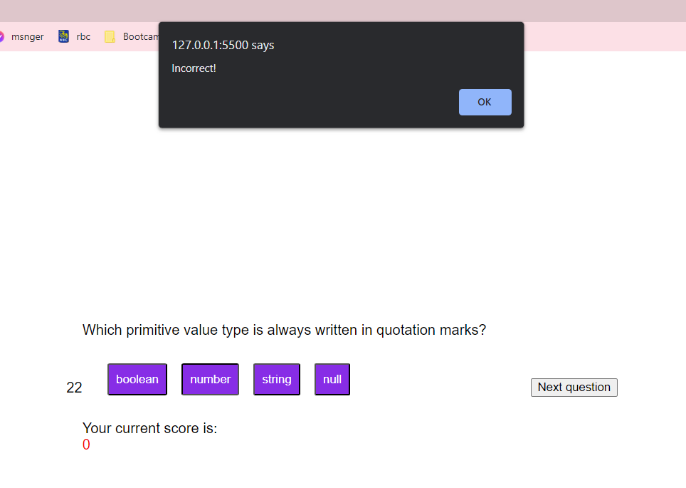

# Quiz for Javascript Concepts

## Description
The Quiz for Javascript Concepts is a website where users can test their knowledge on Javascript concepts and see what they got right or wrong. They are also under a time constraint - which is indicated by the timer on the side of the page. 

## Installation
The website can be accessed on any browser by inputting the URL for the deployed site into the address bar. Once on the page, they will click "Start Quiz" and then be led to the first question. 

## Usage
Once the website can be accessed through the deployed site URL, the user will need to initialize the quiz by clicking the purple "Start Quiz" button at the bottom of the text box. 
1. Click "Start Quiz"

2. Select the correct answer from the listed options

3. If the answer is correct, you will be alerted "Correct!" and the message "Good Job!" will display under the question. 

4. If the answer is wrong, you will be alerted "Incorrect!" and the message "Keep Trying!" will display under the question. 

Please note that at the bottom of the questions, their a score of how many questions the user has gotten right so far. Additionally, the message "Time has run out" displays when the timers for the quiz runs out. 

The process of implementing a high score list is still currently in development. 

## Credits
N/A

## License
N/A